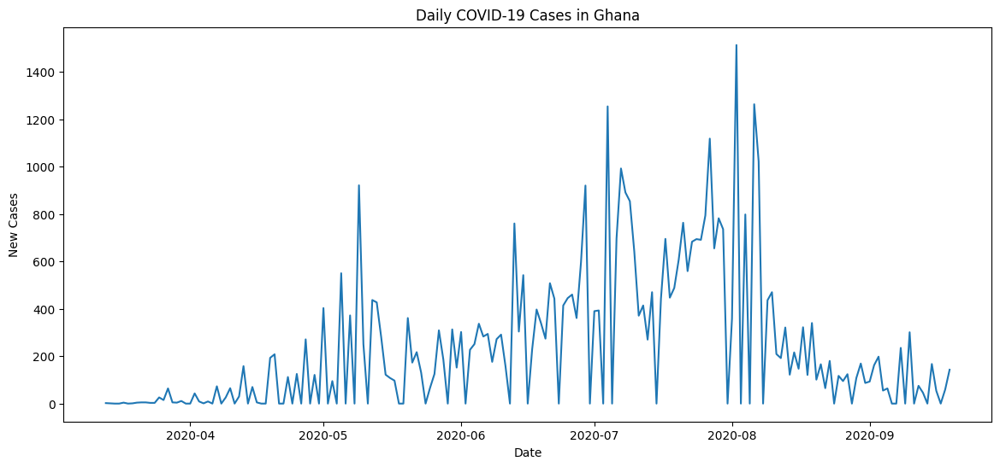
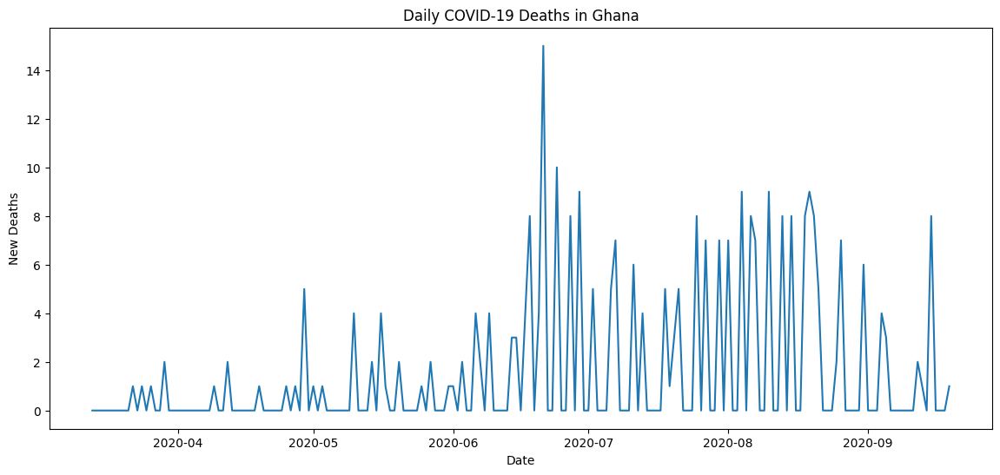
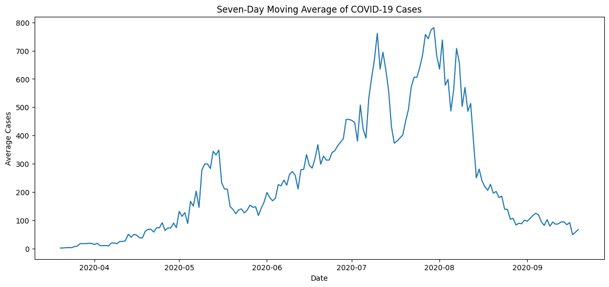
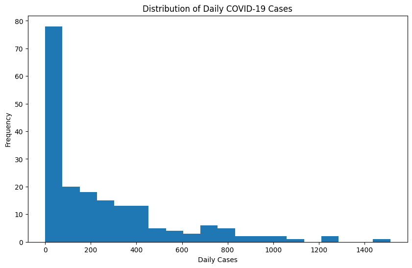
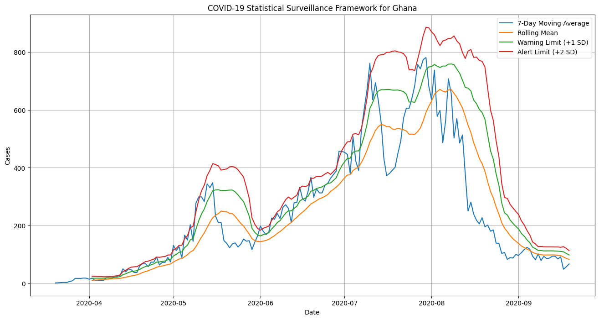
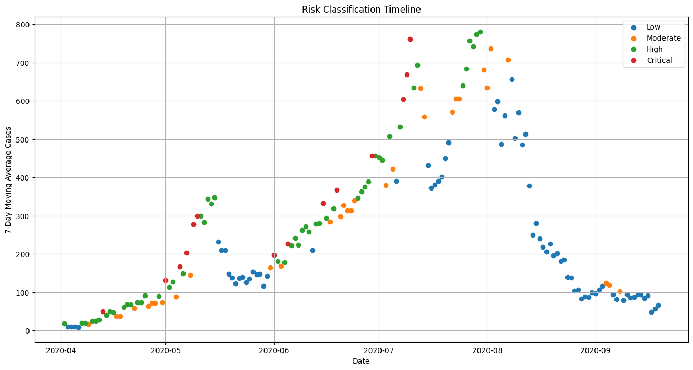
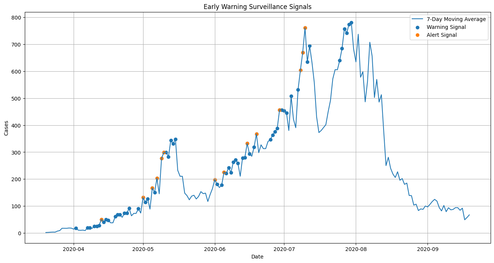
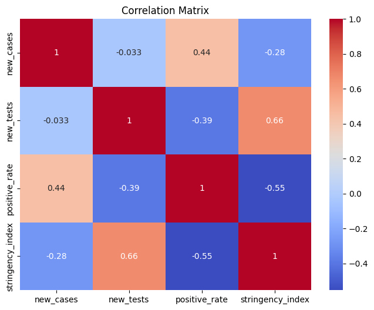

# COVID-19 Statistical Surveillance System for Ghana

## Executive Summary

This project develops a statistical surveillance framework for monitoring COVID-19 transmission dynamics in Ghana using daily epidemiological data from the Our World in Data (OWID) COVID-19 database. The study applies descriptive statistics, time-series analysis, statistical process monitoring, correlation analysis, and regression modeling to identify transmission patterns, evaluate public health indicators, and detect potential outbreak signals.

Using 190 daily observations collected between 13 March 2020 and 19 September 2020, the project investigates trends in reported cases, deaths, testing activity, positivity rates, and government intervention measures. A seven-day moving average surveillance framework was implemented to reduce daily reporting variability and improve outbreak detection. Statistical warning and alert thresholds were developed using rolling means and standard deviations to identify periods of elevated transmission risk.

The analysis identified 67 warning signals and 14 alert signals, with the longest alert period occurring from 8 July 2020 to 10 July 2020. Correlation and regression analyses further revealed significant relationships between COVID-19 case counts, positivity rates, testing levels, and government response measures.

This project demonstrates how statistical surveillance methodologies can support early outbreak detection, public health decision-making, and evidence-based policy evaluation in resource-constrained settings.

## Research Objectives

The primary objective of this project is to develop a statistical surveillance system capable of monitoring and detecting unusual increases in COVID-19 transmission within Ghana.

Specific objectives include:

1. Examine temporal trends in daily COVID-19 cases and deaths.
2. Assess testing activity and positivity rates throughout the study period.
3. Develop a statistical surveillance framework using moving averages and control limits.
4. Detect warning and alert signals associated with increased disease transmission.
5. Classify outbreak risk levels using quantitative surveillance thresholds.
6. Investigate relationships between case counts, testing activity, positivity rates, and government response measures.
7. Evaluate the usefulness of statistical monitoring techniques for public health decision-making.

## Dataset Description

The dataset was obtained from the Our World in Data COVID-19 repository and contains daily COVID-19 observations reported for Ghana.

### Dataset Characteristics

| Metric | Value |
|----------|----------|
| Country | Ghana |
| Observation Period | 13 March 2020 – 19 September 2020 |
| Number of Observations | 190 |
| Original Variables | 41 |
| Variables Used in Analysis | 6 |

### Variables Used

| Variable | Description |
|-----------|-------------|
| date | Observation date |
| new_cases | Daily reported COVID-19 cases |
| new_deaths | Daily reported COVID-19 deaths |
| new_tests | Daily COVID-19 tests conducted |
| positive_rate | Test positivity rate |
| stringency_index | Government response stringency measure |

### Data Quality Assessment

Missing values were observed primarily in testing-related variables:

| Variable | Missing Values |
|------------|---------------|
| new_tests | 66 |
| positive_rate | 16 |
| stringency_index | 16 |

The surveillance analysis focused on maintaining data integrity while accounting for incomplete observations in selected variables.

## Methodology

The project was organized into six analytical stages.

### Stage 1: Data Acquisition and Understanding

The Ghana-specific subset was extracted from the complete OWID COVID-19 dataset and examined for completeness, variable availability, and temporal coverage.

### Stage 2: Data Cleaning and Preparation

Relevant variables were selected, data types were validated, and missing values were assessed to ensure analytical consistency.

### Stage 3: Exploratory Data Analysis

Time-series visualizations and descriptive statistics were used to investigate trends, distributions, and variability in COVID-19 cases and deaths.

### Stage 4: Statistical Surveillance Framework

A seven-day moving average was constructed to smooth daily fluctuations and improve outbreak monitoring.

The following indicators were calculated:

- Seven-day moving average
- Rolling mean
- Rolling standard deviation
- Warning threshold (+1 standard deviation)
- Alert threshold (+2 standard deviations)

### Stage 5: Early Warning Signal Detection

Days exceeding surveillance thresholds were classified as warning or alert signals and grouped into outbreak periods.

### Stage 6: Driver and Policy Analysis

Relationships among epidemiological indicators were examined using:

- Pearson correlation analysis
- Correlation matrix visualization
- Multiple linear regression
- Policy-response evaluation using the Stringency Index

  ## Exploratory Data Analysis

Exploratory Data Analysis (EDA) was conducted to investigate temporal patterns, variability, and distributions of COVID-19 indicators in Ghana.

The analysis focused on:

- Daily reported cases
- Daily reported deaths
- Testing activity
- Positivity rate
- Government response measures

Descriptive statistics indicated substantial variability in transmission patterns during the study period.

| Statistic | New Cases |
|------------|------------|
| Mean | 241.35 |
| Median | 128.00 |
| Maximum | 1513 |
| Standard Deviation | 293.91 |

The large standard deviation relative to the mean suggests considerable fluctuations in daily transmission levels throughout the pandemic period.

### Key Observations

- Daily case counts varied substantially over time.
- Several periods exhibited rapid increases in transmission.
- Reported deaths remained relatively low compared with case counts.
- Positivity rates fluctuated considerably during the study period.
- Government response measures intensified as transmission increased.

### Visualizations

#### Daily COVID-19 Cases

#### Daily COVID-19 Deaths

#### Seven-Day Moving Average of Cases

#### Distribution of Daily Cases

## Statistical Surveillance Framework

A statistical surveillance framework was developed to monitor changes in COVID-19 transmission over time.

The framework was designed to reduce daily reporting noise while improving the detection of unusual increases in disease activity.

### Surveillance Components

The following indicators were calculated:

- Seven-day moving average
- Rolling mean
- Rolling standard deviation
- Warning threshold
- Alert threshold

Thresholds were defined using statistical control principles:

- Warning Threshold = Rolling Mean + 1 Standard Deviation
- Alert Threshold = Rolling Mean + 2 Standard Deviations

These thresholds enabled the classification of transmission periods according to risk level.

### Risk Classification Framework

| Risk Level | Description |
|------------|-------------|
| Low | Below warning threshold |
| Moderate | Exceeds warning threshold |
| High | Elevated transmission activity |
| Critical | Exceeds alert threshold |

### Risk Distribution

| Risk Level | Percentage |
|------------|------------|
| Low | 42.11% |
| High | 30.99% |
| Moderate | 18.71% |
| Critical | 8.19% |

The majority of observations were classified as Low Risk; however, multiple periods of elevated transmission were detected throughout the study period.

### Surveillance Visualization

## Early Warning Signal Detection

An early warning system was implemented to identify periods where transmission exceeded expected levels.

The objective was to detect potential outbreak signals before sustained increases in case counts occurred.

### Results

| Indicator | Value |
|------------|---------|
| Warning Signals | 67 |
| Alert Signals | 14 |
| Warning Signal Percentage | 36.41% |
| Alert Signal Percentage | 7.61% |

### Alert Period Analysis

A total of eleven distinct alert periods were identified.

The longest alert period occurred between:

- Start Date: 8 July 2020
- End Date: 10 July 2020
- Duration: 3 Days

### Alert Duration Summary

| Statistic | Value |
|------------|--------|
| Mean Duration | 1.27 Days |
| Median Duration | 1 Day |
| Maximum Duration | 3 Days |

### Interpretation

Most alert periods were short-lived, suggesting that elevated transmission events were generally localized and temporary rather than sustained over extended periods.

These findings demonstrate how statistical monitoring tools can support outbreak detection and situational awareness.

### Early Warning Visualization

## Statistical Drivers of COVID-19 Transmission

Correlation analysis and multiple linear regression were used to investigate factors associated with changes in daily COVID-19 case counts.

### Correlation Analysis

| Relationship | Correlation |
|-------------|-------------|
| Cases vs Tests | -0.033 |
| Cases vs Positivity Rate | 0.444 |
| Cases vs Stringency Index | -0.279 |

### Key Findings

- Positivity rate exhibited the strongest association with reported cases.
- Testing volume showed almost no linear relationship with daily case counts.
- Government stringency measures demonstrated a negative relationship with transmission.

### Correlation Matrix

### Statistical Significance

Pearson correlation testing produced the following results:

| Relationship | p-value |
|-------------|----------|
| Tests vs Cases | 0.728 |
| Positivity Rate vs Cases | < 0.001 |
| Stringency vs Cases | 0.003 |

The results suggest that positivity rate and government intervention measures were statistically associated with reported case counts during the study period.
